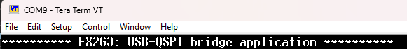

# EZ-USB&trade; FX2G3: USB-QSPI bridge application

This application implements a bidirectional USB-QSPI bridge device using a custom USB vendor-specific interface.


[View this README on GitHub.](https://github.com/Infineon/mtb-example-fx2g3-usb-qspi-bridge)

[Provide feedback on this code example.](https://yourvoice.infineon.com/jfe/form/SV_1NTns53sK2yiljn?Q_EED=eyJVbmlxdWUgRG9jIElkIjoiQ0UyNDIwOTQiLCJTcGVjIE51bWJlciI6IjAwMi00MjA5NCIsIkRvYyBUaXRsZSI6IkVaLVVTQiZ0cmFkZTsgRlgyRzM6IFVTQi1RU1BJIGJyaWRnZSBhcHBsaWNhdGlvbiIsInJpZCI6InN1bWl0Lmt1bWFyQGluZmluZW9uLmNvbSIsIkRvYyB2ZXJzaW9uIjoiMS4wLjAiLCJEb2MgTGFuZ3VhZ2UiOiJFbmdsaXNoIiwiRG9jIERpdmlzaW9uIjoiTUNEIiwiRG9jIEJVIjoiV0lSRUQiLCJEb2MgRmFtaWx5IjoiSFNMU19VU0IifQ==)


## Requirements


- [ModusToolbox&trade;](https://www.infineon.com/modustoolbox) v3.5 or later (tested with v3.5)
- Board support package (BSP) minimum required version: 4.3.3
- Programming language: C
- Associated parts: [EZ-USB&trade; FX2G3](https://www.infineon.com/cms/en/product/promopages/ez-usb-fx2g3/)


## Supported toolchains (make variable 'TOOLCHAIN')

- GNU Arm&reg; Embedded Compiler v14.2.1 (`GCC_ARM`) – Default value of `TOOLCHAIN`
- Arm&reg; Compiler v6.22 (`ARM`)


## Supported kits (make variable 'TARGET')

- [EZ-USB&trade; FX2G3 DVK](https://www.infineon.com/cms/en/product/promopages/ez-usb-fx2g3/) (`KIT_FX2G3_104LGA`) – Default value of `TARGET`


## Hardware setup

This example uses the board's default configuration with the inclusion of the FPGA add-on board. See the kit user guide to ensure that the board is configured correctly.


## Software setup

See the [ModusToolbox&trade; tools package installation guide](https://www.infineon.com/ModusToolboxInstallguide) for information about installing and configuring the tools package.

Install a terminal emulator if you do not have one. Instructions in this document use [Tera Term](https://teratermproject.github.io/index-en.html).

Install the **EZ-USB&trade; FX Control Center** (Alpha) application from [Infineon Developer Center](https://softwaretools.infineon.com/tools/com.ifx.tb.tool.ezusbfxcontrolcenter).


## Using the code example


### Create the project

The ModusToolbox&trade; tools package provides the Project Creator as both a GUI tool and a command line tool.

<details><summary><b>Use Project Creator GUI</b></summary>

1. Open the Project Creator GUI tool

   There are several ways to do this, including launching it from the dashboard or from inside the Eclipse IDE. For more details, see the [Project Creator user guide](https://www.infineon.com/ModusToolboxProjectCreator) (locally available at *{ModusToolbox&trade; install directory}/tools_{version}/project-creator/docs/project-creator.pdf*)

2. On the **Choose Board Support Package (BSP)** page, select a kit supported by this code example. See [Supported kits](#supported-kits-make-variable-target)

   > **Note:** To use this code example for a kit not listed here, you may need to update the source files. If the kit does not have the required resources, the application may not work

3. On the **Select Application** page:

   a. Select the **Applications(s) Root Path** and the **Target IDE**

      > **Note:** Depending on how you open the Project Creator tool, these fields may be pre-selected for you

   b. Select this code example from the list by enabling its check box

      > **Note:** You can narrow the list of displayed examples by typing in the filter box

   c. (Optional) Change the suggested **New Application Name** and **New BSP Name**

   d. Click **Create** to complete the application creation process

</details>


<details><summary><b>Use Project Creator CLI</b></summary>

The 'project-creator-cli' tool can be used to create applications from a CLI terminal or from within batch files or shell scripts. This tool is available in the *{ModusToolbox&trade; install directory}/tools_{version}/project-creator/* directory.

Use a CLI terminal to invoke the 'project-creator-cli' tool. On Windows, use the command-line 'modus-shell' program provided in the ModusToolbox&trade; installation instead of a standard Windows command-line application. This shell provides access to all ModusToolbox&trade; tools. You can access it by typing "modus-shell" in the search box in the Windows menu. In Linux and macOS, you can use any terminal application.

The following example clones the "[EZ-USB&trade; FX2G3: USB-QSPI bridge application](https://github.com/Infineon/mtb-example-fx2g3-usb-qspi-bridge)" application with the desired name "USB_QSPI_Bridge" configured for the *KIT_FX2G3_104LGA* BSP into the specified working directory, *C:/mtb_projects*:

   ```
   project-creator-cli --board-id KIT_FX2G3_104LGA --app-id mtb-example-fx2g3-usb-qspi-bridge --user-app-name USB_QSPI_Bridge --target-dir "C:/mtb_projects"
   ```

The 'project-creator-cli' tool has the following arguments:

Argument | Description | Required/optional
---------|-------------|-----------
`--board-id` | Defined in the <id> field of the [BSP](https://github.com/Infineon?q=bsp-manifest&type=&language=&sort=) manifest | Required
`--app-id`   | Defined in the <id> field of the [CE](https://github.com/Infineon?q=ce-manifest&type=&language=&sort=) manifest | Required
`--target-dir`| Specify the directory in which the application is to be created if you prefer not to use the default current working directory | Optional
`--user-app-name`| Specify the name of the application if you prefer to have a name other than the example's default name | Optional

<br>

> **Note:** The project-creator-cli tool uses the `git clone` and `make getlibs` commands to fetch the repository and import the required libraries. For details, see the "Project creator tools" section of the [ModusToolbox&trade; tools package user guide](https://www.infineon.com/ModusToolboxUserGuide) (locally available at {ModusToolbox&trade; install directory}/docs_{version}/mtb_user_guide.pdf).

</details>


### Open the project

After the project has been created, you can open it in your preferred development environment.


<details><summary><b>Eclipse IDE</b></summary>

If you opened the Project Creator tool from the included Eclipse IDE, the project will open in Eclipse automatically.

For more details, see the [Eclipse IDE for ModusToolbox&trade; user guide](https://www.infineon.com/MTBEclipseIDEUserGuide) (locally available at *{ModusToolbox&trade; install directory}/docs_{version}/mt_ide_user_guide.pdf*).

</details>


<details><summary><b>Visual Studio (VS) Code</b></summary>

Launch VS Code manually, and then open the generated *{project-name}.code-workspace* file located in the project directory.

For more details, see the [Visual Studio Code for ModusToolbox&trade; user guide](https://www.infineon.com/MTBVSCodeUserGuide) (locally available at *{ModusToolbox&trade; install directory}/docs_{version}/mt_vscode_user_guide.pdf*).

</details>


<details><summary><b>Command line</b></summary>

If you prefer to use the CLI, open the appropriate terminal, and navigate to the project directory. On Windows, use the command-line 'modus-shell' program; on Linux and macOS, you can use any terminal application. From there, you can run various `make` commands.

For more details, see the [ModusToolbox&trade; tools package user guide](https://www.infineon.com/ModusToolboxUserGuide) (locally available at *{ModusToolbox&trade; install directory}/docs_{version}/mtb_user_guide.pdf*).

</details>

### Using this code example with specific products

By default, the code example builds for the `CYUSB2318-BF104AXI` product.


#### List of supported products

- `CYUSB2318-BF104AXI`

- `CYUSB2317-BF104AXI`


#### Setup for a different product

Perform the following steps to build this code example for a different, supported product:

1. Launch the BSP assistant tool:

   a. **Eclipse IDE:** Launch the **BSP Assistant** tool by navigating to **Quick Panel** > **Tools**

   b. **Visual Studio Code:** Select the ModusToolbox&trade; extension from the menu bar, and launch the **BSP Assistant** tool, available in the **Application** menu of the **MODUSTOOLBOX TOOLS** section from the left pane

2. In **BSP Assistant**, select **Devices** from the tree view on the left

3. Choose `CYUSB231x-BF104AXI` from the dropdown menu on the right

4. Click **Save**

   This closes the **BSP Assistant** tool

5. Navigate the IDE's **Explorer** and delete the *GeneratedSource* folder (if available) at *`<bsp-root-folder>`/bsps/TARGET_APP_KIT_FX2G3_104LGA/*

   > **Note:** For products `CYUSB2315-BF104AXI` and `CYUSB2316-BF104AXI`, additionally delete the **.cyqspi* file from the *config* directory

6. Launch the **Device Configurator** tool

   a. **Eclipse IDE:** Select your project in the project explorer, and launch the **Device Configurator** tool by navigating to **Quick Panel** > **Tools**

   b. **Visual Studio Code:** Select the ModusToolbox&trade; extension from the left menu bar, and launch the **Device Configurator** tool, available in the **BSP** menu of the **MODUSTOOLBOX TOOLS** section from the left pane

7. Correct the issues (if any) specified in the **Errors** section on the bottom

   a. For a switch from the `CYUSB2318-BF104AXI` product to any other, a new upper limit of 100 MHz is imposed on the desired frequency that can originate from the PLL. Select this issue and change the desired frequency from 150 MHz to 75 MHz

   b. The `CLK_PERI` clock, which is derived from this new source frequency, is also affected. To restore it to its original frequency, go to the **System Clocks** tab, select `CLK_PERI`, and set its divider to '1' (instead of '2')


## Compile-time configurations

This application's functionality can be customized by setting variables in *Makefile* or by configuring them through `make` CLI arguments.

- Run the `make build` command or build the project in your IDE to compile the application and generate a USB bootloader-compatible binary. This binary can be programmed onto the EZ-USB&trade; FX2G3 device using the **EZ-USB&trade; FX Control Center** application

- Choose between the **Arm&reg; Compiler** or the **GNU Arm&reg; Embedded Compiler** build toolchains by setting the `TOOLCHAIN` variable in *Makefile* to `ARM` or `GCC_ARM` respectively. If you set it to `ARM`, ensure to set `CY_COMPILER_ARM_DIR` as a make variable or environment variable, pointing to the path of the compiler's root directory

Additional settings can be configured through macros specified by the `DEFINES` variable in *Makefile*:

**Table 3. Macro description**

Macro name               |  Description                          |    Allowed values
:--------                | :-------------                        | :------------
USBFS_LOGS_ENABLE        | Enable debug logs through the USBFS port  | 1u for debug logs over USBFS<br> 0u for debug logs over UART (SCB4)
THROUGHPUT_TEST_ENABLE   | Enable functionality of the throughput tests | 1u to allow throughput testing<br> 0u to use stub functions instead
<br>


## Operation

> **Note:** This code example currently supports Windows hosts. Support for Linux and macOS will be added in upcoming releases.

1. Connect the board (J2) to your PC using the provided USB cable

2. Connect the USBFS port (J7) on the board to the PC for debug logs

3. Open a terminal program and select the Serial COM port. Set the serial port parameters to 8N1 and 921600 baud

4. Follow these steps to program the board using the [**EZ-USB&trade; FX Control Center**](https://softwaretools.infineon.com/tools/com.ifx.tb.tool.ezusbfxcontrolcenter) (Alpha) application
      
   1. Perform the following steps to enter into the **Bootloader** mode:

      a. Press and hold the **PMODE** (**SW1**) switch<br>
      b. Press and release the **RESET** switch<br>
      c. Release the **PMODE** switch<br>
      
   2. Open **EZ-USB&trade; FX Control Center** application

   	The **EZ-USB&trade; FX2G3** device displays as **EZ-USB FX BOOTLOADER**
      
   3. Navigate to **Device Selection** > **Devices**, select **EZ-USB FX BOOTLOADER**, and then click the **Program** > **Internal Flash** option

   4. Navigate to the *<CE Title>/build/APP_KIT_FX2G3_104LGA/Release* folder within the CE directory and locate the *.hex* file and program
      
   5. Confirm if the programming is successful in the log window of the application

   6. After programming, the application starts automatically. Confirm that the following title is displayed on the UART terminal:


      **Figure 1. Terminal output on program startup**

      

      The device enumerates as a WinUSB device

5. Open the **EZ-USB&trade; FX Control Center** application

6. Select the device and click **Program** > **External Flash**, and navigate to **FPGA binary** to program the external flash


## Debugging

By default, the USBFS port is enabled for debug logs.

To enable debug logs on UART, set **USBFS_LOGS_ENABLE** compiler flag to '0u' in *Makefile*. SCB4 of the EZ-USB&trade; FX2G3 device is used as UART with a baud rate of 921600 to send out log messages through the P11.0 pin.

Debug the code example by setting debug levels for the UART logs. Set the **DEBUG_LEVEL** macro in *main.c* file with the following values for debugging:

**Table 1. Debug values**

Macro value  | Description
:--------    | :-------------
1u           | Enable only error messages
2u           | Enable error and warning messages
3u           | Enable error, warning, and info messages
4u           | Enable all message types

<br>


## Design and implementation

This application implements a bidirectional USB-QSPI bridge device using a USB vendor specific interface.

> **Note:** This application is designed to work without any connected slave device(s) on the QSPI lines, and maximizes throughput. The introduction of a slave device requires appropriate changes in the code, and could bottleneck application performance.

The vendor specific USB interface includes three endpoints:

- **Command endpoint:** EP1-OUT is used as the command endpoint and the desired interface parameters are sent to the device in the form of an [8 or 16 byte packet](#Bridge-command-handling) through this endpoint

- **Data OUT endpoint:** EP2-OUT is used to send data to the FX2G3 device which is to be transmitted to the connected slave devices

- **Data IN endpoint:** EP3-IN is used to receive the data fetched by the FX2G3 device from the slave devices connected to it


### Application workflow

The application flow involves the following stages:

- Initialization
- USB device enumeration
- Bridge command handling


#### Initialization

During initialization, the following steps are performed:

1. All the required data structures are initialized

2. USBD and USB driver (CAL) layers are initialized

3. The application registers all descriptors supported by function/application with the USBD layer

4. The application registers callback functions for different events like `RESET`, `SUSPEND`, `RESUME`, `SET_CONFIGURATION`, `SET_INTERFACE`, `SET_FEATURE`, and `CLEAR_FEATURE`. USBD calls the respective callback function when the corresponding events are detected

5. The data transfer state machines are initialized

6. The application registers handlers for all relevant interrupts

7. The application makes the USB device visible to the host by calling the Connect API


#### USB device enumeration

1. During USB device enumeration, the host requests for descriptors that are already registered with the USBD layer during the initialization phase

2. The host sends the `SET_CONFIGURATION` and `SET_INTERFACE` commands to activate the required function in the device

3. After the `SET_CONFIGURATION` and `SET_INTERFACE` commands, the application task takes control and enables the endpoints for data transfer


#### Bridge command handling

Once the device has enumerated, you can send a command through the EP1-OUT command endpoint, which could then be followed by data transfers over QSPI through either EP2-OUT or EP3-IN. The command options are as shown below:

**Table 2. Bridge device commands**

Commands              | Associated firmware macro      | Description
:--------             | :-------------                 | :----------
0xB0                  | `VENDOR_CMD_START_WRITE`       | Start write stream - The device enters continuous write state (`STATE_CONT_WRITE`). Any data sent through EP2-OUT is transferred over QSPI lines
0xB1                  | `VENDOR_CMD_STOP_WRITE`        | Stop write stream - The device exits continuous write state and returns to `STATE_IDLE`
0xB2                  | `VENDOR_CMD_START_READ`        | Start read stream - The device enters continuous read state (`STATE_CONT_READ`). Any data from the QSPI devices is queued to EP3-IN endpoint
0xB3                  | `VENDOR_CMD_STOP_READ`         | Stop read stream - The device exits continuous read state and returns to `STATE_IDLE`
0xB4                  | `VENDOR_CMD_SMIF_STATUS`       | Get QSPI bridge device status - The statuses of the SMIF FIFO queues and the SMIF IP block are checked
0xB5                  | `VENDOR_CMD_SMIF_THROUGHPUT`   | Measure QSPI throughput - The firmware performs QSPI transfers (without USB involvement) and logs the performance
0xC0&nbsp;`<freq>`    | `VENDOR_CMD_SET_SMIF_CLK_FREQ` | Set QSPI clock frequency - This command includes the `<freq>` byte, specifying the frequency value. The value is set as the SMIF clock frequency in MHz (valid range: 11 to 39, i.e, 0x0A to 0x27)

<br>


##### QSPI bridge testing

The tools in this directory will help you test the QSPI bridge device. Ensure the device is connected and not open in another application (such as Control Center). Detailed information is also available in the [test speeds *Readme*](./COMPONENT_TEST_SPEEDS/README.md).


###### [*run_test_script.bat*](./COMPONENT_TEST_SPEEDS/run_test_script.bat)

Navigate to the [*COMPONENT_TEST_SPEEDS* directory](./COMPONENT_TEST_SPEEDS/) and launch the [*run_test_script.bat*](./COMPONENT_TEST_SPEEDS/run_test_script.bat) script from an instance of command prompt.

The script performs the following:

1. Ensures python is available
2. Creates a virtual environment and activate it
3. Runs `scripts\qspi_bridge_test_app.py` within the virtual environment

This default run of `scripts\qspi_bridge_test_app.py` will test a default write of 100 MB.


###### Running more tests

Follow the steps below to run read, write, frequency change, and mixed tests:

1. Ensure that the virtual environment is created and activated (run above script)

2. Run the following command:

```cmd
python scripts\qspi_bridge_test_app.py --help
```

3. The program output displays various options to use for testing the device


###### Example test commands

- Generate a result chart by testing writes and reads for QSPI clock frequencies from 11 MHz to 16 MHz:

   ```powershell
   python scripts\qspi_bridge_test_app.py --test chart --chart-min-freq 12 --chart-max-freq 16
   ```

- Set the QSPI clock to 26 MHz:

   ```powershell
   python scripts\qspi_bridge_test_app.py --test set-clk --clk-mhz 26
   ```

- Test QSPI write with 120 MB data:

   ```powershell
   python scripts\qspi_bridge_test_app.py --test write --size 120
   ```

- Test QSPI read and write both, with 60 MB data:

   ```powershell
   python scripts\qspi_bridge_test_app.py --test both --size 60
   ```


## Application files

**Table 4. Application file description**

File name             | Details
:--------             | :-------------
*app_version.h*       | Application version information
*cm0_code.c*          | Cortex-M0+ binary code blob used at startup
*main.c*              | Main application function that takes care of device initialization
*usb_bridge_device.h* | Header file for USB-QSPI bridge function
*usb_bridge_device.c* | Source file implementing USB-QSPI bridge function
*qspi.h*              | Header file for QSPI data transfer functions
*qspi.c*              | Source file implementing QSPI data transfer functions
*usb_app.h*           | Header file for USB function
*usb_app.c*           | Source file implementing USB device level logic
*Makefile*            | GNU make compliant build script for compiling this example

<br>


## Related resources

Resources  | Links
-----------|----------------------------------
User guide | [EZ-USB&trade; FX2G3 SDK user guide](./docs/EZ-USB-FX2G3-SDK-User-Guide.pdf)
Code examples  | [Using ModusToolbox&trade;](https://github.com/Infineon/Code-Examples-for-ModusToolbox-Software) on GitHub
Device documentation | [EZ-USB&trade; FX2G3 datasheets](https://www.infineon.com/cms/en/product/promopages/ez-usb-fx2g3/#!?fileId=8ac78c8c90530b3a01909c03f29537e0)
Development kits | Select your kits from the [Evaluation board finder](https://www.infineon.com/cms/en/design-support/finder-selection-tools/product-finder/evaluation-board)
Libraries on GitHub  | [mtb-pdl-cat1](https://github.com/Infineon/mtb-pdl-cat1) – PSOC&trade; 6 Peripheral Driver Library (PDL) and documents
Middleware on GitHub  | [usbfxstack](https://github.com/Infineon/usbfxstack) – USBFXStack middleware library and documents
Tools  | [ModusToolbox&trade;](https://www.infineon.com/modustoolbox) – ModusToolbox&trade; software is a collection of easy-to-use libraries and tools enabling rapid development with Infineon MCUs for applications ranging from wireless and cloud-connected systems, edge AI/ML, embedded sense and control, to wired USB connectivity using PSOC&trade; Industrial/IoT MCUs, AIROC&trade; Wi-Fi and Bluetooth&reg; connectivity devices, XMC&trade; Industrial MCUs, and EZ-USB&trade;/EZ-PD&trade; wired connectivity controllers. ModusToolbox&trade; incorporates a comprehensive set of BSPs, HAL, libraries, configuration tools, and provides support for industry-standard IDEs to fast-track your embedded application development

<br>


### Compatibility information:

- This code example uses the PDL layer for direct communication with device peripherals, without relying on HAL peripheral APIs

- This code example relies on the USBFXStack middleware library for USBFS and does not support USBFS through the USB Device Middleware Library


## Other resources

Infineon provides a wealth of data at [www.infineon.com](https://www.infineon.com) to help you select the right device, and quickly and effectively integrate it into your design.


## Document history

Document title: *CE242094* – *EZ-USB&trade; FX2G3: USB-QSPI bridge application*

 Version | Description of change
 ------- | ---------------------
 1.0.0   | Initial version

<br>


All referenced product or service names and trademarks are the property of their respective owners.

The Bluetooth&reg; word mark and logos are registered trademarks owned by Bluetooth SIG, Inc., and any use of such marks by Infineon is under license.

PSOC&trade;, formerly known as PSoC&trade;, is a trademark of Infineon Technologies. Any references to PSoC&trade; in this document or others shall be deemed to refer to PSOC&trade;.

---------------------------------------------------------

© Cypress Semiconductor Corporation, 2026. This document is the property of Cypress Semiconductor Corporation, an Infineon Technologies company, and its affiliates ("Cypress").  This document, including any software or firmware included or referenced in this document ("Software"), is owned by Cypress under the intellectual property laws and treaties of the United States and other countries worldwide.  Cypress reserves all rights under such laws and treaties and does not, except as specifically stated in this paragraph, grant any license under its patents, copyrights, trademarks, or other intellectual property rights.  If the Software is not accompanied by a license agreement and you do not otherwise have a written agreement with Cypress governing the use of the Software, then Cypress hereby grants you a personal, non-exclusive, nontransferable license (without the right to sublicense) (1) under its copyright rights in the Software (a) for Software provided in source code form, to modify and reproduce the Software solely for use with Cypress hardware products, only internally within your organization, and (b) to distribute the Software in binary code form externally to end users (either directly or indirectly through resellers and distributors), solely for use on Cypress hardware product units, and (2) under those claims of Cypress's patents that are infringed by the Software (as provided by Cypress, unmodified) to make, use, distribute, and import the Software solely for use with Cypress hardware products.  Any other use, reproduction, modification, translation, or compilation of the Software is prohibited.
<br>
TO THE EXTENT PERMITTED BY APPLICABLE LAW, CYPRESS MAKES NO WARRANTY OF ANY KIND, EXPRESS OR IMPLIED, WITH REGARD TO THIS DOCUMENT OR ANY SOFTWARE OR ACCOMPANYING HARDWARE, INCLUDING, BUT NOT LIMITED TO, THE IMPLIED WARRANTIES OF MERCHANTABILITY AND FITNESS FOR A PARTICULAR PURPOSE.  No computing device can be absolutely secure.  Therefore, despite security measures implemented in Cypress hardware or software products, Cypress shall have no liability arising out of any security breach, such as unauthorized access to or use of a Cypress product. CYPRESS DOES NOT REPRESENT, WARRANT, OR GUARANTEE THAT CYPRESS PRODUCTS, OR SYSTEMS CREATED USING CYPRESS PRODUCTS, WILL BE FREE FROM CORRUPTION, ATTACK, VIRUSES, INTERFERENCE, HACKING, DATA LOSS OR THEFT, OR OTHER SECURITY INTRUSION (collectively, "Security Breach").  Cypress disclaims any liability relating to any Security Breach, and you shall and hereby do release Cypress from any claim, damage, or other liability arising from any Security Breach.  In addition, the products described in these materials may contain design defects or errors known as errata which may cause the product to deviate from published specifications. To the extent permitted by applicable law, Cypress reserves the right to make changes to this document without further notice. Cypress does not assume any liability arising out of the application or use of any product or circuit described in this document. Any information provided in this document, including any sample design information or programming code, is provided only for reference purposes.  It is the responsibility of the user of this document to properly design, program, and test the functionality and safety of any application made of this information and any resulting product.  "High-Risk Device" means any device or system whose failure could cause personal injury, death, or property damage.  Examples of High-Risk Devices are weapons, nuclear installations, surgical implants, and other medical devices.  "Critical Component" means any component of a High-Risk Device whose failure to perform can be reasonably expected to cause, directly or indirectly, the failure of the High-Risk Device, or to affect its safety or effectiveness.  Cypress is not liable, in whole or in part, and you shall and hereby do release Cypress from any claim, damage, or other liability arising from any use of a Cypress product as a Critical Component in a High-Risk Device. You shall indemnify and hold Cypress, including its affiliates, and its directors, officers, employees, agents, distributors, and assigns harmless from and against all claims, costs, damages, and expenses, arising out of any claim, including claims for product liability, personal injury or death, or property damage arising from any use of a Cypress product as a Critical Component in a High-Risk Device. Cypress products are not intended or authorized for use as a Critical Component in any High-Risk Device except to the limited extent that (i) Cypress's published data sheet for the product explicitly states Cypress has qualified the product for use in a specific High-Risk Device, or (ii) Cypress has given you advance written authorization to use the product as a Critical Component in the specific High-Risk Device and you have signed a separate indemnification agreement.
<br>
Cypress, the Cypress logo, and combinations thereof, ModusToolbox, PSoC, CAPSENSE, EZ-USB, F-RAM, and TRAVEO are trademarks or registered trademarks of Cypress or a subsidiary of Cypress in the United States or in other countries. For a more complete list of Cypress trademarks, visit www.infineon.com. Other names and brands may be claimed as property of their respective owners.
